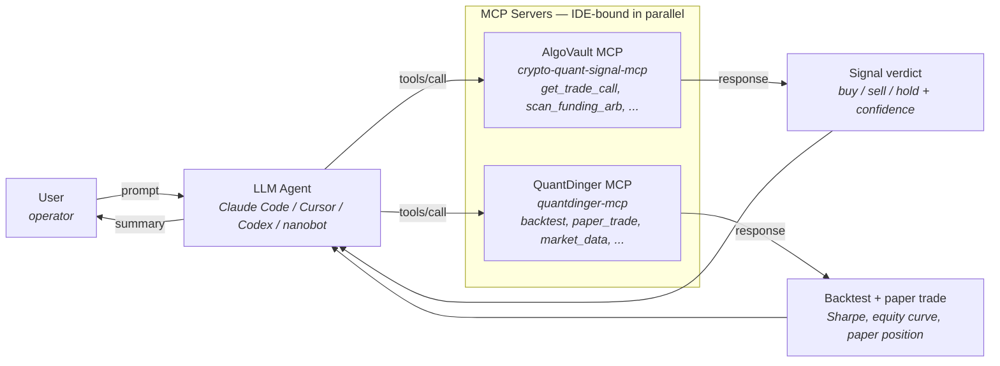

# examples/quantdinger

[QuantDinger](https://github.com/brokermr810/QuantDinger) is a self-hosted AI quant operating system. This folder ships as a **reference-architecture document** instead of transform code: QuantDinger exposes its capabilities as an MCP server (`quantdinger-mcp` on PyPI) for AI agents to consume, but its backend does not document an outbound MCP client. The cross-MCP signal flow happens at the LLM-prompt layer, not at either backend.

## When this pattern applies

Use the reference-architecture-doc shape (this folder) instead of transform code (G2-W1 ai4trade, G2-W2 Nautilus, G2-W3 3Commas) when:

- The downstream platform is itself an MCP server.
- The downstream platform's backend does not document an outbound MCP-client capability.
- The natural integration point is the LLM agent that binds both MCP servers in its IDE config.
- Future versions may ship outbound MCP-client support; this folder migrates to transform-code shape then.

## Architecture diagram



The LLM agent is the orchestration layer. Neither MCP server reaches the other directly.

## Recommended setup

Install both MCP servers in your IDE config. Both Claude Code and Cursor use the same `mcpServers` JSON shape:

```json
{
  "mcpServers": {
    "algovault": {
      "command": "npx",
      "args": ["-y", "crypto-quant-signal-mcp"]
    },
    "quantdinger": {
      "command": "uvx",
      "args": ["quantdinger-mcp"]
    }
  }
}
```

Config file paths per IDE:

| IDE | Path |
|---|---|
| Claude Code (CLI) | `~/.claude/mcp.json` (or via `claude mcp add`) |
| Claude Desktop | `~/Library/Application Support/Claude/claude_desktop_config.json` (macOS) |
| Cursor | `~/.cursor/mcp.json` (or Settings → MCP Servers) |
| Codex / nanobot | Per their respective docs |

QuantDinger's MCP server expects environment variables for its Agent Gateway token (`QUANTDINGER_AGENT_TOKEN`) — see the [QuantDinger docs](https://www.quantdinger.com/docs.html) for issuance. AlgoVault's MCP requires no env vars for the free `get_trade_call` tier.

Verify both servers expose tools by asking the agent:

> List the tools available from both `algovault` and `quantdinger` MCP servers.

The agent should enumerate `get_trade_call` (AlgoVault) and `backtest` / `paper_trade` / etc. (QuantDinger).

## Sample LLM prompts

The following prompts demonstrate four cross-MCP workflow patterns. Each one orchestrates both MCP servers via the agent's tool-call loop.

### Prompt 1 — Verdict-then-backtest (one-shot)

> Get AlgoVault's verdict for BTC on the 5m timeframe via BINANCE. If the verdict is buy or sell, ask QuantDinger to backtest a simple trend-following strategy in that direction for BTC over the last 30 days and report the Sharpe ratio.

Agent flow: `algovault.get_trade_call(BTC, 5m, BINANCE)` → branch on verdict → `quantdinger.backtest(...)` → summarize.

### Prompt 2 — Gated execution (confidence + Sharpe threshold)

> Fetch AlgoVault's verdict for ETH 15m on BINANCE. Only if confidence is above 0.70 AND a QuantDinger backtest of that direction over the last 60 days shows Sharpe above 1.0, paper-trade via QuantDinger's `paper_trade` tool with a 100 USD position. Otherwise log the decision and skip.

Agent flow: two MCP probes feed a single gating decision; paper-trade only on AND-condition pass.

### Prompt 3 — Verdict cross-validation (HOLD vs backtest edge)

> AlgoVault says HOLD on SOL 1h via BINANCE. Ask QuantDinger to backtest both long-only and short-only strategies on SOL for the last 90 days. If either direction shows a positive Sharpe above 0.8, surface the conflict between AlgoVault's HOLD and QuantDinger's apparent edge — and ask me which to trust.

Agent flow: cross-validate a HOLD verdict against an independent backtest; surface conflicts to the operator instead of auto-resolving.

### Prompt 4 (Bonus) — Continuous ops

> Every morning at 09:00 UTC, fetch AlgoVault verdicts for BTC, ETH, SOL on the 1h timeframe via BINANCE. For each non-HOLD verdict, run a QuantDinger 30-day backtest in that direction and append the verdict + Sharpe + max-drawdown to a daily summary I can review.

Agent flow: scheduled (via the agent's scheduling tool or external cron) cross-MCP loop; results aggregated for operator review. Requires the agent to have a scheduling primitive — Claude Code's `schedule` skill or an external cron triggering `claude --print`.

## Why no transform code

- The factory shape `(signal: VerifiableSignalV1) => XRequest | null` from G2-W1/W2/W3 assumes a downstream that accepts a POST or in-process publish. QuantDinger's MCP server accepts neither — it accepts MCP tool-call requests, which an LLM agent issues, not a transformer.
- The natural orchestration point is the LLM's tool-call loop. Wrapping that in a transformer would add a layer without removing one.
- The IDE-mediated pattern is also more flexible: the agent can compose AlgoVault + QuantDinger calls dynamically based on the prompt, instead of running a fixed transform pipeline.
- Operators who want a deterministic pipeline can write one in Python or TypeScript using the `mcp` SDK on both ends — but that's an application choice, not a library this folder ships.

## Future-stable — when this changes

- If QuantDinger ships outbound MCP-client support in a future version (their backend natively consumes external MCPs), this folder migrates to a `transform.ts` + `run.ts` shape mirroring G2-W1/W3, with `make_quantdinger_request(config)` returning a curried function per the shared factory contract.
- If a different downstream platform ships an HTTP webhook or in-process adapter for signal ingestion, that platform ships as transform code under its own `examples/<platform>/` folder; this folder stays as the canonical cross-MCP reference.

## Tested against

- `quantdinger-mcp` `0.1.0` on PyPI (released 2026-05-02; verified 2026-05-23 still latest, single release).
- `brokermr810/QuantDinger` GitHub repository at `pushed_at: 2026-05-20T06:25:54Z` (verified 2026-05-23: 6,395 stars / 1,391 forks / Apache-2.0; no architecture change since W1 audit's `outbound MCP grep returns 0`).
- AlgoVault MCP `crypto-quant-signal-mcp@1.18.1` at `https://api.algovault.com/mcp`.
- Verifiable-Signal v1.0 spec at commit [`06d76e3`](https://github.com/AlgoVaultLabs/crypto-quant-signal-mcp/blob/main/docs/INTEROP-SPEC-v1.md).
- IDE targets: Claude Code, Cursor, Codex, OpenClaw, nanobot (per QuantDinger PyPI summary).

Re-verify if any upstream drifts — particularly QuantDinger's MCP outbound-client capability (re-run `curl -fsS https://www.quantdinger.com/docs.html | grep -ciE "outbound|external.mcp|mcp.client"` and expect 0).

## License + attribution

QuantDinger is [Apache-2.0](https://github.com/brokermr810/QuantDinger/blob/main/LICENSE). This folder is MIT (matching the mono-repo) — see [LICENSE](../../LICENSE) at the repo root. The cross-MCP orchestration pattern itself is unencumbered: it is a workflow, not a license-sensitive code derivative.
